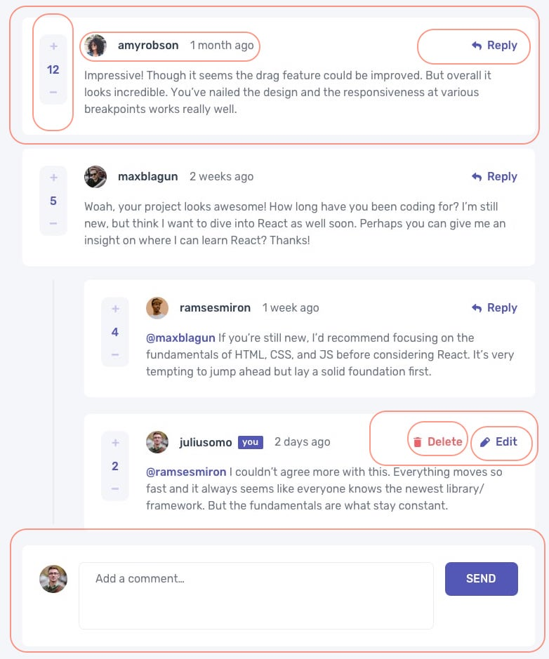
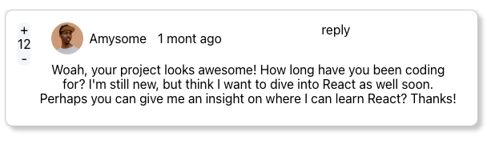
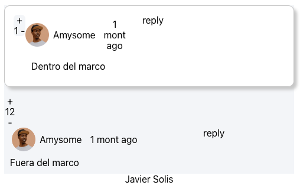
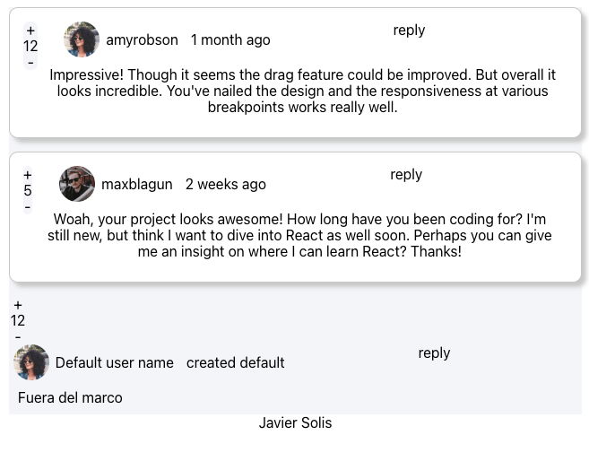

# Tabla de contenido

- [Tabla de contenido](#tabla-de-contenido)
- [Descripción](#descripci-n)
- [Clases](#clases)
  * [Clase 01](#clase-01)
    + [Notas](#notas)
    + [Resultado](#resultado)
  * [Clase 02](#clase-02)
    + [Notas](#notas)
    + [Resultado](#resultado)
- [Notas importantes](#notas-importantes)
- [Problemas frecuentes](#problemas-frecuentes)
- [Referencias](#referencias)


# Descripción
Proyecto para probar las nociones del curso de react

# Clases

## Clase 01
### Notas
- React no es una framework, es una librería
- package.json tiene todoa la configuración del proyecto
- En package.json tambien estan las dependencias
- todo lo que esta en node_modules es lo que se indico en las dependencias
- browserList, indica si el uso es mayor a 0.2% es donde funcionara
```json
# file: package.json>browserlist
...
 "production": [
      ">0.2%",
      "not dead",
      "not op_mini all"
    ],
...
```
- el archivo package-lock.json, recaba la ultima información de como se configuró el proyecto
- no es necesario subir node_modulos, en si lo que este indicado en .gitignore que se crea a crear el proyecto react
- index.js mete la aplicación con react en root el cual se definio en el archivo index.html del public, pero en donde se trabajara es en App.js
- Para el curso solo se usará los componentes por clases
- Los componentes en react esta hechos con funciones, entonces se puede crear una función que regrese el html separandolo despues

```js
...
function App() {
  return (
    <div className="App">
      {/*lo que se extraera*/}
      Hola Mundo
      <br/>
      
      {/*lo que se extraera*/}
    </div>
  );
}
...
```

```js
//se separo el contenido en esta función
...
const createContent=()=>{
  return (
    <>
    Hola Mundo
    <br/>
    
    </>
  )
}

function App() {
  return (
    <div className="App">
      {createContent()}
    </div>
  );
}
...
```
### Resultado


## Clase 02
### Notas
- Para practicar se tomara un reto de https://www.frontendmentor.io/ , teniendo el diseño propuesto y realizaremos su funcionalidad. 
- Para separar en componentes lo mostrado en el diseño se usa la metodología Atomic Design
<br>Video de referencia: 
https://www.youtube.com/watch?v=VVUpVVWZULw
  16:17 Talves se piense mucho en como calificar cada parte, pero como se dice en el video "no lo pienses demasiado", la idea es dividirlo y tener una jerarquía
  25:21 caso de ejemplo de como se uso en General electric, lo modificó para ser mas entendible para su organizacion, la idea es que sea útil para ti

- <span style="color:red">que hacer en caso el mismo atomo se repite en dos lugares, se toma como diferentes o se aplica??</span>
- Se usará este diseño, se muestra las divisiones para cada componente

- Una primera división sería
```js
<div className='comments-page'>

        <div className='comment-card'>
          <div className='vote-comment'>
            <div className='content-comment'>
              <div className='profile-comment'>
                Foto
              </div>
              <div className='action-comment'>
                reply
              </div>
              <div className='text-comment'>
                lore ipsum
              </div>
            </div>
          </div>
        </div>

      </div>
```

- Se puede agregar los estilos en linea o en App.css; si se hace en linea, ojo, usar camel case en caso sea una propiedad con nombre separada por guión como background-color
```js


```
- En este caso se indico una clase en cada componente y luego se modifo app.css para darle estilos



  añadiendo todo en app.js se ve asi:

  ```js
  <div className="App">
      <div className='comments-page'>

        <div className='comment-card'>
          <div className='vote-comment'>
            + 12 -
          </div>
          <div className='content-comment'>
              <div className='content-top-commet'>
                <div className='profile-comment'>

                  
                   <label className='user-comment'>Amysome</label>
                   <label className='timeago-comment'>1 mont ago</label>
                
                </div>
                <div className='action-comment'>
                  reply
                </div>  
              </div>
              <div className='text-comment'>
              Woah, your project looks awesome! How long have you been coding for? I'm still new, but think I want to dive into React as well soon. Perhaps you can give me an insight on where I can learn React? Thanks!
              </div>
            </div>
        </div>

      </div>

    </div>
  ```

- Pasandolo a componentes:
  Se crea la carpeta Components en src
  El nombre del componente debe ser tipo CamelCase sin carcateres especiales ni espacios
  Dentro de su carpeta un index.js
  Lo que se pasará al index, debe pasarse dentro de lo que retorna la funcion

  ```js
  ///file src/Components/CommentCard/index.js
  const CommentCard=()=>{
      return (
          <Copiar aquí el contenido>
      )
  }
  export default CommentCard
  ```

  Luego en App.js, se llama al componente asi:

```js
import CommentCard from './Components/CommentCard';
...
function App() {
  return (
    <div className="App">
      <div className='comments-page'>
        <CommentCard />
      </div>

    </div>
  );
}

```

- Otra opción son los MODULOS, que e algo mas generico que un componente, por ejemplo crearemos un modulos para tener constantes para el texto de Power by

```js
//file:/src/Modules/ModuleConstantPoweredBy.js
const POWERED_BY="Javier Solis"
export default POWERED_BY
```
- y para usarlo se debe importar

```js
...
import POWERED_BY from './Modules/ModuleConstantPoweredBy';

function App() {
  return (
    <div>
      ...
      {POWERED_BY}
    </div>
  );
}

export default App;
```
- Para añadir pasar argumetos a un componente se pasa por propiedades, por ejemplo para añadir al componente

```js
 <CommentCard 
          vote='12'
          user='Javier'
          comment='Comentario de prueba'
        />
```
- dentro del componente se puede destructurar los valores y usarlos
```js
 const CommentCard=props=>{
  const {vote,user,comment}=props
  return (
    ...
      <div className='vote-comment'>
        + {vote} -
      </div>
      ...
          <div className='text-comment'>
            {comment}
          </div>
       ...
  
    )
}
export default CommentCard
```
- Añadiendo otro el App.js quedaría asi
```js
...
        <CommentCard 
          vote='12'
          user='Javier'
          comment='Comentario de prueba'
        />
        <CommentCard 
          vote='1'
          user='JOse'
          comment='Otro comentarios'
        />
...
```


- En caso algun valor no se pase, se puede definir valores por defecto
```js
  const {vote,user,comment="default"}=props
```

- Ahora añadiremos un componente dentro de otro, para eso se usa la propiedad predefinida chidlre de props, y esta se añade al componente padre
- Por ejemplo, del diseño vemos que el marco blanco del fondo se repite

- Lo extraemos en un componente FrameWhite
```js
//file: src/Components/FrameWhite/index.js
const FrameWhite=props=>{
    return (
      <div className='comment-card'>
        {props.children}
      </div>
      )
  }
  export default FrameWhite
```
- Cambiamos el componente CommentsCard quitandole el marco.
```js
const CommentCard=props=>{
  const {vote,user,comment}=props
  return (
    <>
    {/*<!--div className='comment-card'-->*/}
      ...
    {/*<!--/div-->*/}
    </>
    )
}
export default CommentCard
```
- Por ultimo reordenamos los componentes en App.js para que Comment este dentro de FrameWhite
```js
...
import FrameWhite from './Components/FrameWhite';
...

function App() {
  return (
    <div className="App">
      <div className='comments-page'>
        <FrameWhite>
          <CommentCard
            vote='1'
            user='Ejemplo de children'
            comment='Dentro del marco'
          />
        </FrameWhite>
        <CommentCard 
          vote='12'
          user='Javier'
          comment='Fuera del marco'
        />
      </div>
      {POWERED_BY} 
    </div>
  );
}
export default App;
```


- En caso sea mas de un children, para trabajar con ellos en el que los contiene,los trata como un array
```js
//para llamar al 1 hijo
{props.children[0]}
```

- Para aplicarlo con datos, como aún no vemos como obtenerlo por fetch, creamos un modulo con la data
```js
//file:src/Modules/ModuleData.js
const DATA={
    ...el contenido es el json que descargamos de frontmentor...
  }
export default DATA  
```
- Modificamos el comment card para dibujar los datos, createAt, y para probar user lo pasamos como un objeto y asi dibujamos sus propiedades, con esto probado se pudo haber pasado todo el objeto comment en ves de cada campo***
```js
const CommentCard=props=>{
  const {vote,user,comment,createdAt="created default"}=props
  return (
    <>
    {/*<!--div className='comment-card'-->*/}
      
      <div className='vote-comment'>
        + {vote} -
      </div>
      ...
              
               <label className='user-comment'>{user.username}</label>
               <label className='timeago-comment'>{createdAt}</label>
          ...
          <div className='text-comment'>
            {comment}
          </div>
      ...
    </>
    )
}
export default CommentCard
```

- Tambien se debe copiar los archivos de imagenes en la carpeta public
- Finalmente se edita el app.js para obtener los datos y pasarlos al componente
```js
...
import DATA from './Modules/ModuleData';
const DEFAULT_USER={"image":{"png":"/images/avatars/image-amyrobson.png"},"username":"Default user name"}

function App() {
  return (
    <div className="App">
      <div className='comments-page'>
        {
          DATA.comments.map(comment=>{
            return (<FrameWhite>
              <CommentCard
                vote={comment.score}
                user={comment.user}
                comment={comment.content}
                createdAt={comment.createdAt}
              />
            </FrameWhite>)
          })
        }
        
        <CommentCard 
          vote='12'
          user={DEFAULT_USER}
          comment='Fuera del marco'
        />
        ...
```

### Resultado


# Notas importantes
- Los componentes se ubica en src/Components dentro un index.js
- Estandar de nombre de componentes es CamelCase
- Para agregar comentario en el html 
```js
 {/*comentario*/}
```
- Para agregar imágenes se importa indicando su ruta y luego se usa lo que se importó

```js
import holamundo from './holamundo.jpeg'
...
  return (
    ...
    
    ...
  );
...
```
- React site https://es.reactjs.org/


```cmd
## Crear aplicación
npx create-react-app curso-reat-v18

## Lanzar
npm start
```


# Problemas frecuentes

- 

# Referencias
- Retos para practidar el front
https://www.frontendmentor.io/
- Documentación de react 
https://es.reactjs.org
- TOC para Markdowm 
http://ecotrust-canada.github.io/markdown-toc/
